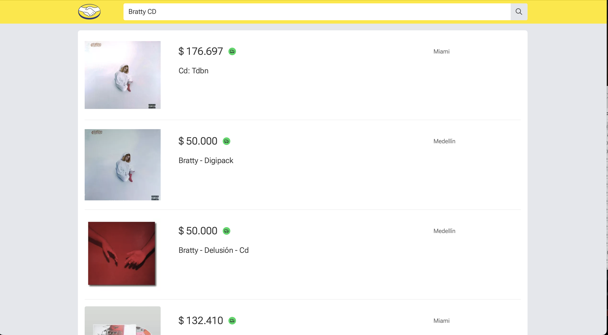

# Mercado Libre demo app

This application utilizes the official Mercado Libre API to recreate a basic version of the official application.

The project was developed using [**Remix**](https://remix.run), a full-stack React framework chosen for its suitability for this demo's requirements, including SEO and performance.

Remix provides us with **SSR** capabilities, which are ideal for enhancing SEO and performance. It allows for server-only code execution, making it suitable for backend tasks such as database interaction or managing sensitive information. Additionally, it offers a client-side rich UI powered by React.

## Insights:

- This application was designed to function seamlessly with or without **JavaScript**. This means that even in unfavorable network conditions or environments where JavaScript is restricted, the application will continue to operate.
- The HTML was carefully crafted with consideration for screen readers and other accessibility requirements. **Semantic HTML** tags and accessibility properties were included to ensure an accessible user experience for all users.
- All network requests to the MELI API were **parallelized** whenever possible, taking advantage of the **HTTP/2 multiplexing** feature. This led to a substantial improvement in network latency and response time.
- The product details are prefetched when the user hovers over a product in the product list. This enables instantaneous navigation to the product details page in many cases.
- This application was architected using a frontend-adapted version of the **clean architecture**, with the UI part following the principles of **atomic design**. This approach ensures excellent scalability as the application grows.

# Getting started

*This application requires node.js 18 or up installed.*

To begin, ensure that you have installed the necessary npm packages.

    npm install

Next, you'll need to create an `env` file. This is only used as a dummy demonstration of the environment variables in a Remix app.

1.  Create a .env file in the root folder.
2.  Use the `.env.example` as a template for this file. You can simply copy the contents of this file into the `.env` file and modify the variable values if necessary.

Finally, you can run the application in dev mode by running the following

    npm run dev

Once started, a development server should be running at `http://localhost:5173/` (check your terminal in case the URL have changed).

# Architecture

[Go to section.](app/)

# Testing

[Go to section.](tests/)

## Deploy
*The demo was already deployed, visit: [meli-demo-app.vercel.app](https://meli-demo-app.vercel.app/ "https://meli-demo-app.vercel.app")*

The application was configured to deploy to [Vercel](https://vercel.com), so the `@vercel/remix` package was installed to ensure compatibility, the npm scripts were modified to continue working in both, dev and production builds.

Some analytics scripts from Vercel were added, such as [Analytics](https://vercel.com/analytics) and [SpeedInsights](https://vercel.com/docs/speed-insights).
